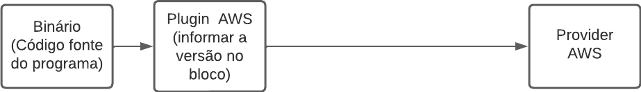

# Terraform 

### Executar com Docker

`docker run -it -v <seu workspace>/terraform-linuxtips:/app -w /app --entrypoint  hashicorp/terraform:light sh`


## Day - 1

Inicialiar projeto terraform e gerar o `terraform.tfstate`
* `terraform init` 

Obter ajuda
 * `terraform -h`  

Instala os plugins disponíveis no terraform
* `terraform init -upgrade`

Utiliza o arquivo state em memória 
* `terraform plan -out <nome-arquivo>` 

Aplicar o plano 

* `terraform apply <nome-arquivo>`   

Liberar o console Terraform  para interagir com as expressões do terraform
* `terraform console`


### Documentação consulta geral

* Providers que se integram com terrraform:   
https://registry.terraform.io/browse/providers   

* Documentação sobre a sintaxe da linguagem HCL    
https://developer.hashicorp.com/terraform/language/providers/requirements

* Documentação de como aplicar os recursos do provider:    
https://registry.terraform.io/providers/hashicorp/aws/latest/docs    


### Variáveis   

* Definições de variáveis no Terrform  
Documentação: https://developer.hashicorp.com/terraform/language/values      

Para declararmos as variáveis, por boas práticas, devemos criar uma arquivo chamado `variables.tf` lá declararemos as variáveis. Elas não precisam ser importados no arquivo do recurso da cloud que estou implementando, o Terraform entende sem a necessidade de importar.   

Como declaramos da maneira mais simples:    

```ruby
variable "ec2_type" {

  type = string
  default = "t3.micro"
  description = "instance for tests"
}
```
__Meta argumentos__ das variáveis:   


Com __type__ definimos o type constraint, a restrição do tipo de valor que a variável deve receber.      
Com o __default__ setamos o valor da variável.        
Com __description__ informamos como boa prática, o que a variável faz e seu motivo.       

##### Definir variável com validação do valor informado 

Abaixo, um exemplo em que usamos o __meta argumento__ __validation__. Nele podemos criar uma condição para nos assegurarmos que o valor informado na variáel, cumpre critérios estabelecidos.  No exemplo abaixo, temos duas condições, a primeira é que o valor tenha de __ec2_instance__ tenha mais que 4 strings e que este tenha "micro" informado entre a string informada. 

```ruby
variable "ec2_instance" {

  type        = string
  default     = "t2.micro"
  description = "set value for instance"

  // validação para garantir que a instância aplicada seja um micro
  validation {
    condition     = length(var.ec2_instance) > 4 && substr(var.ec2_instance, 3, 7) == "micro"
    error_message = "the value for ec2 should be t2.micro"
  }

}
```


### Como funcionam as chamadas para API da AWS com Terraform   

   

### Como se comunica o binário do Terraform com o cloud provider  


## Day - 2  

* Modules Terraform  
Documentação: https://developer.hashicorp.com/terraform/language/modules/develop   

Quando trabalhamos com módulos, cada diretório será um módulo. É importante sempre manter o arquivo `main.tf` (que contém os blocos __terraform__ e __backend__) dentro da raiz (fora de módulos) para não termos problemas, ele é o root module. O módulo é como se fosse um classe, ele encapsula os demais recursos.    

Exemplo do bloco module:   

```ruby
module "server" {

  source  = "./server" // nome do modulo
  servers = 1 // input que o root module impõe ao child module server
}
```

Para obter o output dos recursos criados, devo chamar o bloco de output dentro do arquivo root module (`main.tf`). Para isso, após criar o arquivo de __output__ no módulo filho, preciso evocá-lo no módulo raiz com a seguinte sintaxe:   

```ruby
output "ip_address" {
    
// module + nome do módulo + nome do output criado.

    value = module.server.ip_address
}
```

* Backend  

O Backend define o local em que o Terraform armazenará os dados do arquivo __state__.

Documentação: https://developer.hashicorp.com/terraform/language/settings/backends/configuration  

O bloco do backend fica dentro do bloco do Terraform e normalmente eles são definidos no arquivo main.tf. Exemplo de backend utilizando o S3 da AWS:

```ruby
  backend "s3" {

    bucket = "aws-linux-tips"
    key    = "terraform-test.tfstate"
    region = "us-east-1"
  }
```   

* Comando para baixar as informações do backend (que neste projeto está no S3) dentro de um arquivo:  
`terraform state pull >> aula-backend.tfstate`    

* Comando para caso queira subir as alterações no `.tfstate`   
`terraform state push aula-backend.tfstate`   

### State Locking  

State Locking, é um recurso do backend que grava as informações do __.tfstate__ no banco de dados DynamoDB da AWS. O arquivo fica protegido e bloqueia o uso em paralelo caso alguma operação esteja em curso. Além disso, toda informação de log fica registrada no DynamoDB.  Após configurarmos o bloco resource do banco, devemos informar o nome da tabela no bloco backend como valor de `dynamodb_table`. Como mostrar abaixo: 

```ruby
  backend "s3" {

    // nome da tabela que pode ser visto no arquivo dynamodb.tf

    dynamodb_table = "terraform-state-lock-dynamo" 
    bucket = "aws-linux-tips"
    key    = "terraform-test.tfstate"
    region = "us-east-1"
  }
```

Para manter o banco e não destruí-lo devemos informar o parâmetro `-lock=false` em `terraform destroy -lock=false`. Para fazer um novo plan `terraform plan -lock=false "plano"`. Para applicar o plano `terraform destroy -lock=false "plano"`.  

### State  

* Documentação: https://developer.hashicorp.com/terraform/language/state

State é a maneira que o Terraform armazena as informações da infraestrutura. Por padrão, ele é gerado o arquivo `terrafrom.tfstate`.  

terraform não funciona sem state. Por que ele existe? 

* Serve para mapear o cloud provider (o mundo real).     
* Metada, os metadados estão dentro do state e servem para trackear recursos e dependências.    
* O State pode servir como um mini cache que aumenta a performance na criação da infraestrutura (para infraestruturas maiores podemos passar a tag `-refresh=false` no cli para não precisar carregar tudo de novo).    
`terraform refresh` - Caso seja realizado alguma modificação manual no cloud provider, com esse comando, o terraform vai na cloud, mapeia a alteração e o arquivo state é atualizado.   
* Sincronia, quando temos várias pessoas estão manipulando o mesmo recurso, quando utilizamos o __remote state__, não há necessidade de fazer o refresh de todo state novamente, cada pessoa terá uma cópia da última modificação no Terraform.   

O Terraform possui outras opções na linha de comando para manipular o tstate. Eles são: `terraform state <opções abaixo>` :  
* `list`
* `mv`
* `pull`
* `push`
* `rm`
* `show`

Cada manipulação de escrita que fazemos no terraform state, automaticamente é gerado um backup. Entre todos os comandos, o `terraform state rm` precisa ser usado com cautela, pois ele não se equivale ao `terraform destroy`, ele removerá as informações do tfstate, então perderemos todas informações sobre os recursos neste arquivo, consequentemente a remoção dos recursos terá que ser manual no console do provider.   

### Terraform import    

Documentação: https://developer.hashicorp.com/terraform/cli/commands/import

Caso queira importar um recurso e obter as informações para colocar como expressão do bloco resource desejado, posso utilizar o terrafor state para obter os nomes e parâmetros dos recursos desejados. Para isso utilizo:  
`terraform state pull > testando_impor.tfstate`  

Após isso, abro o arquivo e procuro pelas informações requeridas no resource.  

obs: sempre no final da documentação de um resource, há tbm a linha de como importá-lo.  


### Workspace   

Documentação: https://developer.hashicorp.com/terraform/language/state/workspaces

Workspace é uma configuração que fazemos no __state__. Ele trabalha apenas a nível de state. Quando criamos workspaces, cada um deles será como um novo ambiente e terá um __state__ e um diretório distinto no S3 Bucket chamada de __env__.   

É normal que se coloque cada workspace em uma região diferente.  

Comandos:  

* Para criar um novo workspace:   
`terraform workspace new <nome do workspace>`  

* Para listar os workspace criados:  
`terraform workspace list`   

* Para mudar de workspace  
`terraform workspace select <nome do workspace>`  

## Day - 3  

Documentação e recursos para conseguir ajuda no Terraform.  

* Para linha de comando (CLI), podemos conseguir ajuda através da [documentação](https://developer.hashicorp.com/terraform/cli/commands) no próprio terminal, utilizando o comando:  
  *  `terraform -h`  
  * `terraform <subcomando> -h` Exemplo: `terraform plan -h`  

* Para instalar o autocomplete na linha de comando:   
  * `terraform -install-autocomplete` 

Para acessar ajuda de como trabalhar com os blocos de recursos dos providers, podemos procurar por *registry* através do seguinte caminho: __https://registry.terraform.io/browse/providers__ . Aparecerá uma lista de cloud providers, entre eles podemos escolher aquele que desejamos montar a infraestrutura.  

Importante saber por distinção, que temos a documentação da HCL (HashiCorp Language), a documentação do Terraform e a dos registry que nos mostra como trabalhar com os providers.  


### Terraform Debugging

Documentação: https://developer.hashicorp.com/terraform/internals/debugging  

Variável de ambiente: `TF_LOG`  
Como utilizar:  
`TF_LOG=DEBUG terraform plan -out plano`   
* Posso utilizar o `TF_LOG=DEBUG` em cada comando. Exemplo:
  * `TF_LOG=DEBUG terraform plan`  
  * `TF_LOG=DEBUG terraform apply` 
  * `TF_LOG=DEBUG terraform destroy`   

O resultado será o log com as chamadas e respostas da api do provider através do protocolo http.  

Posso passar como valor de `TF_LOG` os seguintes parâmetros: `TRACE`, `DEBUG`, `INFO`, `WARN` e `ERROR`. __Do *trace* para *error* vai diminuindo o nível de informação no console.__   


### Comando Terraform Taint

Documentação: https://developer.hashicorp.com/terraform/cli/commands/taint  

Com o `terraform taint` posso marcar um recurso para ser destruído no state e __reconstruído__ na próxima vez que rodar um `terraform plan` e `terrafrom apply`. O resultado do comando nãoé destruição do recurso, é para que apenas depois do plan e do apply seja destruído e recriado. Podemos utilizar se um recursos não estiver funcionando corretamente e precisamos marcalo para que da próxima vez seja reconstruído.   

Exemplo de como passar o comando:  `terraform taint aws_instance.web[0]`.    


### Comando Graph  

Documentação: https://developer.hashicorp.com/terraform/cli/commands/graph    
Instalação do Graphviz: http://www.graphviz.org/download/  

__OBS:Este comando exibe a dependências entre os recursos.__

Exemplo de comando:  

* `terraform graph | dot -Tsvg > graph.svg`   

Após a instalação correta do Graphviz, será gerado um arquivo .svg no diretório padrão. Nele, será possível verificar o diagrama em grafos da infraestrutura montada no arquivo.    


### Comando Terraform fmt

Documentação: https://developer.hashicorp.com/terraform/cli/commands/fmt    

Convenção de boas práticas e estilo aplicadas pelo `terraform fmt` estão dentro da seguinte documentação: https://developer.hashicorp.com/terraform/language/syntax/style   

Exemplo de como aplicar o comando:  

* Para apenas verificar arquivos que podem sofrer alterações na formatação, mas não realizar mudanças neste arquivo:  
  *  `terraform fmt -check` 
  * `echo $!` (A saída deste comando bash deve 0 que sempre significa sucesso)    

* Para verificar o arquivo e o tipo de mudança que poderá ser aplicada:   
   * `terraform fmt -check -diff`
   *  `echo $!`   

* Para aplicar as mudanças sugeridas basta remover o `-check`:  
  * `Terraform fmt`
  * `echo $!`


__OBS__: O comando `echo $!` está sendo inserido, mas não é obrigatório. É apenas pra lembrar que ao usar os comandos do `terraform fmt` na pipline, a saída deve ser 0. Caso não, a pipeline vai falhar.   

### Terraform validate  

Documentação: https://developer.hashicorp.com/terraform/cli/commands/validate

Comando importante para usar o código Terraform no CI. Recomenda-se que utilizemos no início do CI para 'logo de cara' validar o código. Esse comando identifica erro de sintaxe no código e se a configuração é válida.  

Exemplo de execução básica:  

`terraform validate`   


## Day - 4 

### Conditionals  

Documentação: https://developer.hashicorp.com/terraform/language/expressions/conditionals

Exemplo de condicionais com Terraform dentro da variável `count` no código abaixo:  

```ruby
resource "aws_instance" "instance_web" {

  # exemplo de condicional com Terraform    

  // count = var.environment == "production" ? 2 : 1  
  // count = var.environment == "production" ? 2 + var.plus : 1  
  // count = var.production ? 2 : 1  // outra forma de expressar a primeira condição  
  count         = !var.production ? 2 : 1 // aqui pergunta se o valor de production e diferente de true, como é, subirá 2 instâncias
  ami           = data.aws_ami.server-ubuntu.id  

  // count.index é utilizado para verificar o índice criado dentro da variável. Para cada índice, temos uma instância aws. 

  instance_type = count.index > 1 ? "t2.micro" : "t3.medium"
  tags = {
    "Name" = "dependecy"
  }

}
```

Para visualizarmos mais de perto. As condicionais são as seguintes:    

Nestes dois exemplo, a variável environment aguarda ter o valor "production" para ser true e setar duas intâncias. No segundo exemplo, se for true, setará 2 + o valor da variável 'plus'.

* `count = var.environment == "production" ? 2 : 1`  
* `count = var.environment == "production" ? 2 + var.plus : 1`   

Abaixo, a variável production espera ser true para setar 2 instâncias. Como é false, seta apenas 1. É a simplificação dis cinabdis acima.
  
* `count = var.production ? 2 : 1`  

Neste caso, com o "!" é a negação da expressão que esperaria o resultado como false, como é diferente de false ela retorna true e cria 2 instâncias. Evitar usa esse tipo de expressão. 
* `count = !var.production ? 2 : 1`  

O `count.index` armazenará um índice para cada instância criada na variável  `count`. Cada índice no exemplo acima é uma instância criada.  
* ` instance_type = count.index > 1 ? "t2.micro" : "t3.medium"`    


### Type constraints   


Documentação: https://developer.hashicorp.com/terraform/language/expressions/type-constraints   

### Laço for_each 

O `for_each` é utilizado dentro do blobo __resource__. Ele é outra maneira de fazer o `count`, porém ele é apropriado quando quisermos passar *valores diferentes* para as variáveis a cada iteração. O `for_each` pode iterar dentro de um tipo __set__ ou __object__.   

Para utilizá-lo, devemos criar primeiro a variável com o tipo *list*, informar o tipo de dado que será passado na lista e qual será nosso default, conforme vemos abaixo no exemplo com a variável __instance_type__.   

```ruby
variable "instance_type" {

  type        = list(string)
  default     = ["t2.micro", "t3.medium"]
  description = "The list of instance type"

}
```  

Como mecncionamos, assim como o `count` ou  `for_each` é informado dentro do bloco resource. Como pode observsar abaixo, temos duas variáveis que vão interagir com o for_each.  

A primeira `for_each`, recebe a variável `instance_type` como um `set` que aponta para os tipos de instâncias dentro de uma lista de strings. A segunda variável, é também  `instance_type` que aplica o valor de cada iteração do laço de repetição. Para atribuir os valores da iteração para instace_type, utiliza-se as palavras reservadas __each__ e __value__: 
 
```ruby
resource "aws_instance" "web" {
  ami           = data.aws_ami.server-ubuntu.id
  for_each      = toset(var.instance_type)
  instance_type = each.value

  tags = {
    "Name" = "Create with loop for"
  }

}
``` 

O tratamento do bloco __output__ também precisa ser adaptado no `for_each`. Definimos a variável `instance` para varrer o recurso `aws_instance` e retornar o __id__ mais o __private_ip__ na linha de comando:  

```ruby
output "ip_adresss" {

  value = {
    for instance in aws_instance.web :
    instance.id => instance.private_ip
  }

}
```  

### Dynamic Blocs   

Documentação: https://developer.hashicorp.com/terraform/language/expressions/dynamic-blocks     

O blocos dinâmicos servem para quando temos recursos aninhados. Por exemplo, na criação de uma máquina EC2, podemos definir um volume EBS para ser anexado nesta máquina. Como pode ser definido vários volumes para uma EC2, posso utilizar o bloco dinâmico para isso.   

Para executar o bloco dinâmico, é necessário o `for_each`, a configuração do arquivo `terraform.tfvars` e nas `variables.tf` definir o nome e o tipo da variável utilizada no bloco dinâmico.  

Vejamos o exemplo abaixo:  

`ec2.tf`   

```ruby
resource "aws_instance" "web_server" {

  ami           = data.aws_ami.ubuntu.id
  instance_type = "t3.micro"

// bloco dinamico serve para criarmos recursos aninhados
// no exemplo abaixo, temos alguns volumes EBS que serão anexados
// a máquina EC2. Para especificá-los usamos o arquivo terraform.tfvars 
// e especificamos o tipo da variável no variables.tf 
// "ebs_block_device" é nome do recurso transformado em bloco dinâmico.

  dynamic "ebs_block_device" {
    for_each = var.blocks

    content {
      volume_type = ebs_block_device.value["volume_type"]
      volume_size = ebs_block_device.value["volume_size"]
      device_name = ebs_block_device.value["device_name"]
    }

  }

}   
```

`terraform.tfvars`
Definição extada do se espera nas propriedades do __ebs_block_device__ dentro da lista de objetos chamada de __blocks__.

```javascript
blocks = [

  {
    volume_type : "gp2",
    volume_size : 5,
    device_name : "/dev/sdg"
  },
  {
    volume_type : "gp2",
    volume_size : 10,
    device_name : "/dev/sdh"
  }
]
```   

`variables.tf`  
Definição do type constraint da variável.   

```ruby 
variable "blocks" {

  type = list(object({
    volume_type : string,
    volume_size = string,
    device_name = string
  }))

  description = "volumns config for EBS"
}
```


### String Templates  

Documentação: https://developer.hashicorp.com/terraform/language/expressions/strings  

Em String Templates, aprendemos a fazer interpoçaão de strings no terraform, como mostra os exemplos abaixo.  

```ruby 
    // exemplo de interpolação de strings
    // "Name" = "hello ${var.name}" 


    // Exemplo de interpolação com condicional
    "Name" = "Hello %{if var.name == "Testando interpolção"}${var.name}%{else}Var name diferente do esperado%{endif}!"
```   


### Terraform Cloud (SaaS)

Documentação: https://cloud.hashicorp.com/products/terraform   

#### Workspace

É o método de organização elementar do Terraform Cloud.   
 https://developer.hashicorp.com/terraform/cloud-docs/workspaces  

 Diferenças entre a execução local do Terraform e sua execução no ambiente do Terraform Cloud:   

 <table><thead><tr><th>Component</th><th>Local Terraform</th><th>Terraform Cloud</th></tr></thead><tbody><tr><td>Terraform configuration</td><td>On disk</td><td>In linked version control repository, or periodically uploaded via API/CLI</td></tr><tr><td>Variable values</td><td>As <code class="mdx-inline-code_inlineCode__mRRzk hds-typography-code-200">.tfvars</code> files, as CLI arguments, or in shell environment</td><td>In workspace</td></tr><tr><td>State</td><td>On disk or in remote backend</td><td>In workspace</td></tr><tr><td>Credentials and secrets</td><td>In shell environment or entered at prompts</td><td>In workspace, stored as sensitive variables</td></tr></tbody></table>   